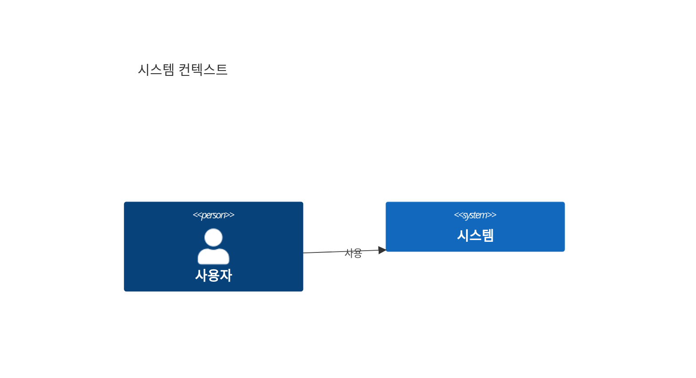

# 비-classic 8. C4 (플레이스홀더 기대)

[정상 마커] 이 문장은 항상 보여야 합니다. 다이어그램이 깨져도 이 줄과 아래 '끝 마커'가 보이면 파서가 문서를 죽이진 않은 것.

```mermaid
C4Context
    title 시스템 컨텍스트
    Person(user, "사용자")
    System(sys, "시스템")
    Rel(user, sys, "사용")
```

---
[끝 마커] 여기까지 보이면 이 다이어그램이 뒤 내용을 깨뜨리지 않음.
